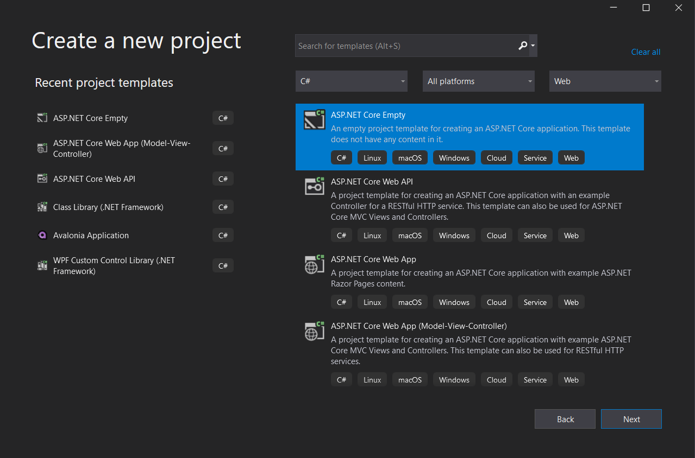

# Api Gateway

Segue tutorial de como produzir uma Api Gateway e deixa-la funcionando.

## criando o projeto

Mostraremos como criar o projeto mais básico do ASP .NET Core que é o projeto necessário para termos uma api Gateway funcionando. 

Será mostrado usando o visual Studio e por linha de comando, muito útil se você estiver trabalhando em linux.

### 1. Visual studo 

Crie um projeto novo usando a opção de ASP .NET Core Empty, conforme a imagem, nomei como APiGatewayTutorial e clique next, não mude nenhuma opção se houver e crie o projeto.



Agora execute o projeto e veja o funcionando.

### 2. Linha de comando

Ou altenativamente faça para cria a pasta onde será salva a solução, depois para criar a solução do projeto, finalmente para criar o projeto básico a ser usado, por fim adiciono o projeto a solucão com 

```sh
mkdir ApiGatewayTutorial
cd ApiGatewayTutorial
dotnet new sln
mkdir ApiGatewayTutorial
cd ApiGatewayTutorial
dotnet new web
cd ..
dotnet sln add ./ApiGatewayTutorial/ApiGatewayTutorial.csproj
```
para testar execute 

```sh
dotnet restore
dotnet run --project ./ApiGatewayTutorial/ApiGatewayTutorial.csproj
```

Deverá ter como resultado algp parecido com:

Vá até o seu navegador e execute [https://localhost:5001](https://localhost:5001) ou [http://localhost:5000](http://localhost:5000)

O resultado será uma tela escrito Hello World.

## Pacotes

* Ocelot 

[Nuget Ocelot](https://www.nuget.org/packages/Ocelot/)

[Github Ocelot](https://github.com/Burgyn/MMLib.SwaggerForOcelot)

[Documentação Ocelot](https://threemammals.com/ocelot)

Instale Ocelot e suas dependencias usando 

1.  package manager   
```
Install-Package Ocelot -Version 17.0.0
```
2. DOTNET CLI
```
dotnet add package Ocelot --version 17.0.0
```
3. Package Reference
```xml
<PackageReference Include="Ocelot" Version="17.0.0" />
```

* MMLib.SwaggerForOcelot

[Nuget MMLib.SwaggerForOcelot](https://www.nuget.org/packages/MMLib.SwaggerForOcelot/)

[Github MMLib.SwaggerForOcelot](https://github.com/Burgyn/MMLib.SwaggerForOcelot)

    Limitation
        Now, this library support only {everything} as a wildcard in routing definition. #68

1.  package manager   
```
Install-Package MMLib.SwaggerForOcelot -Version 4.4.1
```
2. DOTNET CLI
```
dotnet add package MMLib.SwaggerForOcelot --version 4.4.1
```
3. Package Reference
```xml
<PackageReference Include="MMLib.SwaggerForOcelot" Version="4.4.1" />
```

## Codificando

### program.cs

Atualize o `CreateHostBuilder` de

```c#
public static IHostBuilder CreateHostBuilder(string[] args) =>
    Host.CreateDefaultBuilder(args)
        .ConfigureWebHostDefaults(webBuilder =>
        {
            webBuilder.UseStartup<Startup>();
        });
```

para

```c#
public static IHostBuilder CreateHostBuilder(string[] args) =>
    Host.CreateDefaultBuilder(args)
    .ConfigureAppConfiguration((host, config) =>
    {
        config
        .AddJsonFile("ocelot.json", optional: false, reloadOnChange: true)
        .AddEnvironmentVariables();
    })
    .ConfigureWebHostDefaults(webBuilder =>
    {
        webBuilder.UseStartup<Startup>();
    });
```

### ocelot.json

Crie o arquivo `ocelot.json` na raiz do projeto, junto ao `Program.cs`

```json
{
    "Routes": [{
            "DownstreamPathTemplate": "/api/{everything}",
            "DownstreamScheme": "http",
            "DownstreamHostAndPorts": [{
                "Host": "10.0.18.30",
                "Port": 5051
            }],
            "UpstreamHttpMethod": ["GET", "POST", "PUT", "DELETE"],
            "SwaggerKey": "wscadastro",
            "UpstreamPathTemplate": "/cadastro/{everything}"
        },
        {
            "DownstreamPathTemplate": "/api/{everything}",
            "DownstreamScheme": "http",
            "SwaggerKey": "uaa",
            "DownstreamHostAndPorts": [{
                "Host": "10.0.18.30",
                "Port": 5052
            }],
            "UpstreamHttpMethod": ["GET", "POST", "PUT", "DELETE"],
            "UpstreamPathTemplate": "/uaa/{everything}"
        }
    ],
    "GlobalConfiguration": {
        "baseUri": "http://localhost"
    },
    "SwaggerEndPoints": [{
            "Key": "wscadastro",
            "Config": [{
                "Name": "WsCadastro API",
                "Version": "v1",
                "Url": "http://10.0.18.30:5051/WsCadastro/v2/api-docs"
            }]
        },
        {
            "Key": "uaa",
            "Config": [{
                "Name": "Uaa API",
                "Version": "v2",
                "Url": "http://10.0.18.30:5052/v2/api-docs"
            }]
        }
    ]
}
```

Devido a limitação do `MMLib.SwaggerForOcelot` sempre use `{everything}` como wildcard de rota, no arquivo `ocelot.json`, ou o swagger do Api Gateway não irá funcionar corretamente. 

### Startup.cs

Adicione 

```c#
using Microsoft.Extensions.Configuration;
using Ocelot.DependencyInjection;
using Ocelot.Middleware;
```
e
```c#
private readonly IConfiguration Configuration;

public Startup(IConfiguration configuration)
{
    Configuration = configuration;
}
```

Adicone ao metodo `ConfigureServices` os seguintes serviços

```c#
public void ConfigureServices (IServiceCollection services)
{
    // outros metodos, caso existam não foram inclusos.

    //adiciona o servico do swagger para o ocelot
    services.AddSwaggerForOcelot(Configuration, (o) =>
    {
        o.GenerateDocsForGatewayItSelf = true;
    });
    //configura o mvc com compatibilidade com a versão 3.0, mais recente
    services.AddMvc()
        .SetCompatibilityVersion(Microsoft.AspNetCore.Mvc.CompatibilityVersion.Version_3_0);
    // adiciona HttpContextAccessor ao pipeline
    services.AddHttpContextAccessor();
    // adiciona serviço de health check
    services.AddHealthChecks();
    // adiciona o serviço do ocelot
    services.AddOcelot();                
}
```

Adicione ao metodo `Configure`

```c#
public void Configure(IApplicationBuilder app, IWebHostEnvironment env)
{
    app.UseSwaggerForOcelotUI();
    app.UseRouting();
    app.UseStaticFiles();
    app.UseHttpsRedirection();
    app.UseOcelot().Wait();
}
```

## Execute

Execute o projeto e siga para: 
* [http://localhost:5000/swagger/index.html](http://localhost:5000/swagger/index.html)
* [https://localhost:5001/swagger/index.html](https://localhost:5001/swagger/index.html)

Com este tutorial você deve ser capaz de produzir seu primeiro gateway totalmente funcioanl.